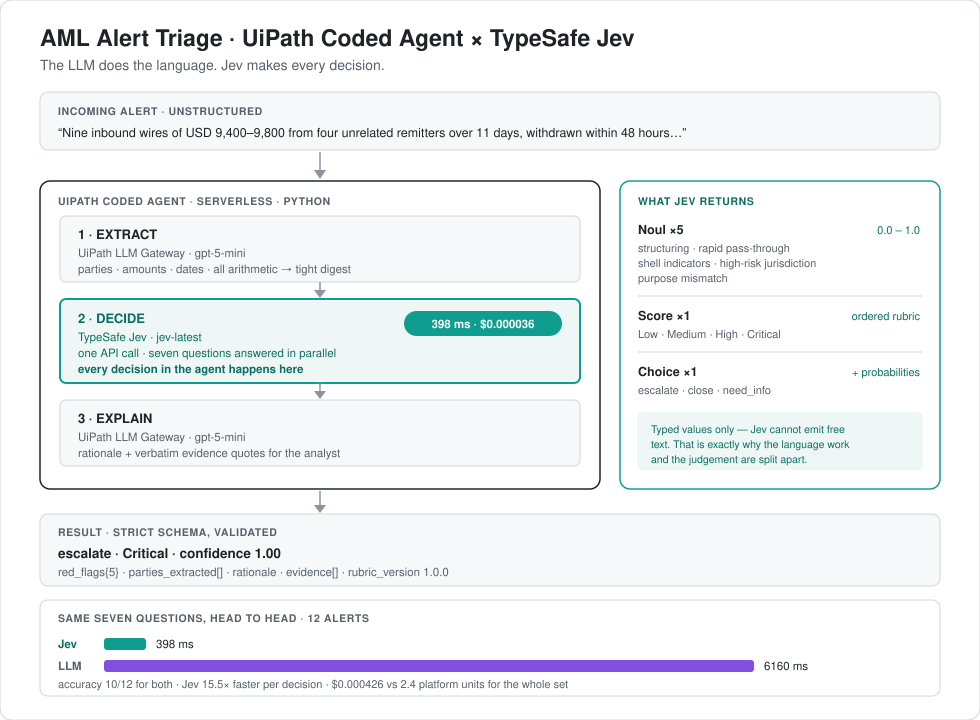

<h1>AML Alert Triage — UiPath Coded Agent × TypeSafe Jev</h1>

<p>
  
  
  
  
</p>

A financial-services demo: a UiPath **coded agent** that triages anti-money-laundering
alerts, where every *decision* is made by TypeSafe's **Jev** model instead of by an LLM.

Jev cannot write a sentence. It returns **typed, calibrated decisions** — yes/no,
pick-one-of-these, rate-on-this-rubric — in about 400ms for a fraction of a cent. So the
agent splits the work along that seam: the language model reads and writes, and Jev judges.



📐 **[docs/diagrams.md](docs/diagrams.md)** — Mermaid views of the architecture, the run
sequence, and how it slots into an operations process, plus the other domains this pattern
fits.

---

## The split

| Layer | Does | Why it's there |
|---|---|---|
| UiPath LLM Gateway (`gpt-5-mini`) | Reads the alert, extracts parties and amounts, does **all** arithmetic, and afterwards writes the rationale | Language work — generation |
| **TypeSafe Jev** (`jev-latest`) | Every decision: 5 red flags, a risk level, the disposition | Typed, calibrated, fast, cheap |

One Jev call answers **seven questions in parallel** against the same state:

- **Noul ×5** → `structuring` · `rapid_pass_through` · `shell_company_indicators` ·
  `high_risk_jurisdiction` · `purpose_mismatch` → each a probability `0.0–1.0`
- **Score ×1** → risk level on the ordered rubric → `Low` / `Medium` / `High` / `Critical`
- **Choice ×1** → the disposition → `escalate` / `close` / `need_info`, with probabilities

---

## Measured results

12 synthetic alerts, hand-authored ground truth, **both deciders answering the same seven
questions** so the comparison is like-for-like:

| | Jev | Gateway LLM |
|---|---|---|
| **Accuracy** | 10/12 (83%) | 10/12 (83%) |
| Schema valid | 12/12 | 12/12 |
| Evidence grounded | 48/48 | 48/48 |
| **Median decision** | **398 ms** | 6160 ms |
| Total decision time | 4.8 s | 74.2 s |
| **Cost for the set** | **$0.000426** | 2.4 platform units |

The two models **agree on 10 of the 12 alerts**.

Reproduce with `python evaluate.py --compare`.

> **Jev wins on speed and cost, not on better answers.** The two models tie on accuracy and
> agree on 10 of 12 alerts. At n=12 the accuracy comparison is not statistically meaningful
> in either direction — don't claim Jev is more accurate than an LLM.

**The calibration is the genuinely interesting part.** Jev's two misses arrive with low
confidence (0.31 and 0.75) while its correct calls sit at 0.89–1.00. A confidence gate at
~0.50 catches one miss without disturbing a single correct decision — which is precisely how
an L1 triage queue is actually operated.

---

## Quickstart

```bash
uv venv --python 3.12 && uv pip install -e .
cp .env.local .env                  # JEV_API_KEY, plus UIPATH_URL / UIPATH_ACCESS_TOKEN
uipath auth                         # or reuse an existing token in .env
uipath init                         # generates entry-points.json / bindings.json

uipath run agent -f evals/sample-escalate.json    # one alert, locally
python evaluate.py --compare                      # the whole set, both deciders
```

Deploy to Orchestrator:

```bash
uipath init                          # ALWAYS re-run after changing the Input model
uipath pack && uipath publish --my-workspace
uipath invoke agent -f evals/sample-escalate.json
```

> ⚠️ **`uipath pack` does not regenerate `entry-points.json`.** Only `uipath init` does. If
> you add a field to `Input` and pack without re-running init, the package ships a stale
> schema: the runtime still accepts the new field when you pass it with `-f`, but the
> Orchestrator **Start job** form is built from that schema and won't show it. Symptom: your
> new argument is invisible in the UI while working fine from the CLI.

---

## Input arguments

| Argument | Type | Required | Notes |
|---|---|---|---|
| `alert_id` | string | **yes** | Free-form identifier, echoed into the result |
| `customer` | string | **yes** | Name plus profile context (jurisdiction, incorporation date) |
| `narrative` | string | **yes** | The alert text. Evidence quotes are checked verbatim against this |
| `account_age_days` | integer | no | Feeds the shell-company judgement |
| `prior_alerts` | integer | no | Alert history on this customer |
| `decider` | `"jev"` \| `"llm"` | no — `"jev"` | **Which model makes the decisions.** The demo's main dial |
| `expected_disposition` | string | no | Ground truth, if known. Enables the `ACCURACY` line in the log |
| `benchmark` | boolean | no — `false` | Also runs the *other* decider on the same alert and logs the comparison |

Ready-to-run inputs live in `evals/`: `sample-escalate.json`, `sample-close.json`,
`sample-ambiguous.json`, `sample-llm.json`.

📋 **[docs/test-examples.md](docs/test-examples.md)** — copy-paste values for every field,
expected results for each, the full 12-alert reference table, and what the logs look like.

---

## Switching the decider

Flip `decider` to put the gateway LLM in Jev's seat. Both arms get the identical
seven-question rubric against the identical digest:

```bash
uipath run agent -f evals/sample-escalate.json   # jev decides (default)
uipath run agent -f evals/sample-llm.json        # same alert, LLM decides
python evaluate.py --decider llm                 # whole set, LLM deciding
python evaluate.py --compare                     # both, side by side
```

Every run logs a summary block:

```
==============================================================
  ALERT            AML-2026-0144
  DECIDER          JEV  (jev-latest)
  DISPOSITION      escalate   confidence 1.00
  RISK             Critical  (3.0)
  ACCURACY         CORRECT   expected=escalate
  DECISION TIME    625 ms
  DECISION COST    $0.00003482   (829 in / 161 out)
  TOTAL RUN TIME   27854 ms  (incl. extract + explain LLM calls)
  ----------------------------------------------------------
  COMPARED TO      LLM
    disposition    escalate   CORRECT
    time           6224 ms
    cost           0.2 platform units
    => jev is 9.96x faster
    agreement      yes
==============================================================
```

**On cost units.** Jev's pricing is documented ($0.042 per million input tokens, output
free) so it's reported in real dollars. UiPath bills gateway LLM calls in *platform units*
(0.2 per call, Standard tier), not dollars — so the log reports units rather than inventing
a price. Set `USD_PER_PLATFORM_UNIT` in `.env` to your contracted rate and both sides print
in dollars.

---

## What you get back

```json
{
  "alert_id": "AML-2026-0144",
  "disposition": "escalate",
  "disposition_confidence": 1.0,
  "risk_level": "Critical",
  "risk_score": 3.0,
  "red_flags": {
    "structuring": 0.72, "rapid_pass_through": 0.97,
    "shell_company_indicators": 0.95, "high_risk_jurisdiction": 0.82,
    "purpose_mismatch": 0.81
  },
  "parties_extracted": ["Aurelia Holdings SA (Panama, nominee directors)", "Latvian bank"],
  "rationale": "...",
  "evidence": ["Single inbound transfer of USD 2,400,000 from a Latvian bank", "..."],
  "rubric_version": "1.0.0",
  "decider": "jev",
  "metrics": { "decision_latency_ms": 625, "decision_cost_usd": 3.4818e-05,
               "correct": true, "other_latency_ms": 6224, "speedup": 9.96 }
}
```

### Where to look in UiPath

The result does **not** appear in the job's Output Arguments panel — that field comes back
empty for coded agents. Two places to look instead:

- **Job log** — the `SUMMARY[01]`…`SUMMARY[16]` lines. They're numbered because Orchestrator
  splits multi-line records and its timestamps collide at sub-millisecond resolution, so
  they arrive out of order; sort by the number. A single-line `SUMMARY_JSON` record always
  survives intact for anything parsing the log.
- **Traces** — 44 spans. The root `LangGraph` span carries the final output; `extract`,
  `decide` and `explain` are children, so you can inspect the digest handed to Jev and Jev's
  raw typed answers separately. `assets_retrieve` shows as redacted — the platform refusing
  to log the API key. Each LLM call also fires twelve ISO 42001 governance guardrail spans.

---

## How it's built

| File | Purpose |
|---|---|
| `main.py` | The LangGraph agent: `extract` → `decide` → `explain`, with both deciders |
| `rubric.py` | **The policy artifact.** Red flags, risk levels, dispositions — this *is* the Jev question set |
| `evals/alerts.json` | 12 synthetic alerts with ground truth (4 deliberately ambiguous) |
| `evaluate.py` | Schema gate, accuracy, evidence grounding, head-to-head comparison |

Change policy in `rubric.py`, not in the agent. `RUBRIC_VERSION` is stamped into every
result, so you can tell which policy produced a given decision.

### Design constraints

`rubric.py` is written around Jev's own documented weaknesses (`model-jaggedness/jev-1.13`):
it is unreliable at arithmetic, cannot order or compare dates, is poor at multi-step
indirection, and loses accuracy when the state carries irrelevant context.

So the LLM does **every** calculation before Jev sees anything, the state Jev receives is a
tight derived digest rather than raw prose, and every question is atomic and
self-contained. Asking Jev to count would be asking it to fail.

### Secrets

Locally the Jev key comes from `.env` (`JEV_API_KEY` or `TYPESAFE_API_KEY`).
**`.env` does not propagate to the serverless runtime** — in the cloud the agent reads the
Orchestrator asset `JevApiKey`. The fallback is in `main.py:_jev_key()`.

---

## Verified, not assumed

- Egress from a UiPath serverless run to `api.typesafe.ai` — **permitted** (200 OK). Nothing
  in UiPath's docs states this either way, so it was spiked before anything was built.
- Orchestrator asset read from inside a serverless coded-agent run — **works**.
- Published and run as `ServerlessJobType: PythonCodedAgent` — **Successful**.
- All numbers in this README come from real runs, not estimates.

## Licence

MIT — see [LICENSE](LICENSE).

## Not built, on purpose

- A Data Fabric entity lookup as an agent tool — demonstrates UiPath plumbing, not Jev.
- Human-in-the-loop escalation to Action Center.
- Studio Web linking (`uipath push`); the Coded agent type there is still Preview.
